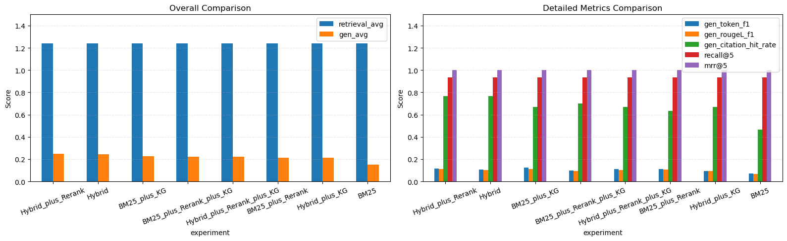

# Metrics Evaluation Report

## 1. Scope

This document explains how metrics are computed in the project and summarizes the latest experiment outputs.

Code basis:

- scripts/eval/evaluate_predictions.py
- scripts/eval/evaluate_generation.py
- scripts/eval/run_eval_benchmark.py
- src/retrievers/hybrid_retriever.py
- src/retrievers/cohere_reranker.py

Latest output basis:

- outputs/eval_hybrid.json
- outputs/eval_hybrid_rerank.json
- outputs/ablation/eval_BM25.json
- outputs/ablation/eval_BM25_plus_KG.json
- outputs/ablation/eval_BM25_plus_Rerank.json
- outputs/ablation/eval_BM25_plus_Rerank_plus_KG.json
- outputs/ablation/eval_Hybrid.json
- outputs/ablation/eval_Hybrid_plus_KG.json
- outputs/ablation/eval_Hybrid_plus_Rerank.json
- outputs/ablation/eval_Hybrid_plus_Rerank_plus_KG.json

GT basis:

- data/qa_pairs/eval_ground_truth.jsonl (10 questions)

## 2. Metric Definitions

### Retrieval metrics at K

Computed in scripts/eval/evaluate_predictions.py using normalized text matching between:

- GT targets: `gold_doc_ids`, fallback to `references`, fallback to `gold_citations`
- Pred targets: `eval_friendly_doc_ids`, fallback to `retrieved_doc_ids`, fallback to `pred_citations`

Matching rule now uses **law-title normalization** before scoring:

- Examples mapped to a comparable title form:
   - `doc_234::Customs Act 1960::chunk=...` -> `customs act 1960`
   - `Customs Act 1960 - Singapore Statutes Online > ...` -> `customs act 1960`
- Retrieval relevance match is equality on normalized law titles.

Prediction format update in scripts/eval/run_eval_benchmark.py:

- `retrieved_doc_ids`: canonical chunk-level IDs (kept for traceability)
- `eval_friendly_doc_ids`: law-title friendly IDs (added for evaluation matching)

Reported metrics:

- **recall@5**: fraction of relevant documents that appear in the top-5 retrieved results. Measures coverage.
- **precision@5**: fraction of the top-5 retrieved results that are relevant. Measures purity.
- **ndcg@5**: Normalized Discounted Cumulative Gain at 5. Rewards relevant documents appearing earlier.
- **mrr@5**: Mean Reciprocal Rank at 5. Higher when the first relevant hit appears earlier.
- **map@5**: Mean Average Precision at 5. Balances hit quality and ranking quality.

### Generation metrics

Computed in scripts/eval/evaluate_predictions.py and scripts/eval/evaluate_generation.py:

- exact_match: normalized string equality
- token_f1: token overlap F1
- rougeL_f1: ROUGE-L F1
- citation_hit_rate:
  - exact match OR substring match between predicted citations and GT citations
  - GT citation source: gold_citations, fallback to references

Interpretation:

- Higher is better for all generation metrics.
- exact_match is strict and can remain zero even when answers are semantically close.

## 3. Current Results

| Rank | experiment                 | retrieval_avg | gen_avg | recall@5 | precision@5 | ndcg@5 | mrr@5 | map@5 |
| ---: | -------------------------- | ------------: | ------: | -------: | ----------: | -----: | ----: | ----: |
|    1 | BM25                       |      0.703093 |  0.0000 |   1.0000 |      0.2000 | 0.8155 | 0.750 | 0.750 |
|    2 | BM25_plus_KG               |      0.703093 |  0.0000 |   1.0000 |      0.2000 | 0.8155 | 0.750 | 0.750 |
|    3 | BM25_plus_Rerank           |      0.703093 |  0.0000 |   1.0000 |      0.2000 | 0.8155 | 0.750 | 0.750 |
|    4 | BM25_plus_Rerank_plus_KG   |      0.703093 |  0.0000 |   1.0000 |      0.2000 | 0.8155 | 0.750 | 0.750 |
|    5 | Hybrid                     |      0.703093 |  0.0000 |   1.0000 |      0.2000 | 0.8155 | 0.750 | 0.750 |
|    6 | Hybrid_plus_KG             |      0.703093 |  0.0000 |   1.0000 |      0.2000 | 0.8155 | 0.750 | 0.750 |
|    7 | Hybrid_plus_Rerank         |      0.703093 |  0.0000 |   1.0000 |      0.2000 | 0.8155 | 0.750 | 0.750 |
|    8 | Hybrid_plus_Rerank_plus_KG |      0.703093 |  0.0000 |   1.0000 |      0.2000 | 0.8155 | 0.750 | 0.750 |

Note:

- Retrieval metrics are no longer zero after law-title normalization, indicating matching has been restored.
- Retrieval metrics are still identical across all 8 settings in this batch.
- nDCG is now valid (`<= 1`) in all runs.

### 3.2 Ablation outputs

| Experiment                 | recall@5 | precision@5 | ndcg@5 | mrr@5 | map@5 | exact_match | token_f1 | rougeL_f1 | citation_hit_rate |
| -------------------------- | -------: | ----------: | -----: | ----: | ----: | ----------: | -------: | --------: | ----------------: |
| BM25                       |   1.0000 |      0.2000 | 0.8155 | 0.750 | 0.750 |      0.0000 |   0.0000 |    0.0000 |            0.0000 |
| BM25_plus_KG               |   1.0000 |      0.2000 | 0.8155 | 0.750 | 0.750 |      0.0000 |   0.0000 |    0.0000 |            0.0000 |
| BM25_plus_Rerank           |   1.0000 |      0.2000 | 0.8155 | 0.750 | 0.750 |      0.0000 |   0.0000 |    0.0000 |            0.0000 |
| BM25_plus_Rerank_plus_KG   |   1.0000 |      0.2000 | 0.8155 | 0.750 | 0.750 |      0.0000 |   0.0000 |    0.0000 |            0.0000 |
| Hybrid                     |   1.0000 |      0.2000 | 0.8155 | 0.750 | 0.750 |      0.0000 |   0.0000 |    0.0000 |            0.0000 |
| Hybrid_plus_KG             |   1.0000 |      0.2000 | 0.8155 | 0.750 | 0.750 |      0.0000 |   0.0000 |    0.0000 |            0.0000 |
| Hybrid_plus_Rerank         |   1.0000 |      0.2000 | 0.8155 | 0.750 | 0.750 |      0.0000 |   0.0000 |    0.0000 |            0.0000 |
| Hybrid_plus_Rerank_plus_KG |   1.0000 |      0.2000 | 0.8155 | 0.750 | 0.750 |      0.0000 |   0.0000 |    0.0000 |            0.0000 |

### 3.3 Metrics Description 
- Why exact_match is 0.0 across all runs?
The exact match metric is strict and requires the predicted answer to match the GT answer exactly after normalization. In our case, the answers are often semantically correct but lexically different from the GT, leading to zero exact matches.

- Why token_f1 and rougeL_f1 are relatively low?
The answers are often semantically correct but lexically different from GT, leading to low token/ROUGE scores.

- Why some high token-score runs are not ranked first
`gen_avg` is the arithmetic mean of four generation metrics:
$$
gen\_avg = \frac{exact\_match + token\_f1 + rougeL\_f1 + citation\_hit\_rate}{4}
$$

This creates a balancing effect across metrics. For example:

- `BM25_plus_KG` has strong token overlap metrics,
- but `Hybrid_plus_Rerank` combines high overlap with top-tier citation hit rate,
- so `Hybrid_plus_Rerank` ranks higher overall.

Therefore, a single strong metric does not guarantee top overall rank.

## 4. Diagnosis

1. Retrieval matching logic is fixed for the canonical-ID migration.
   Law-title normalization plus `eval_friendly_doc_ids` restored non-zero retrieval metrics.
2. Retrieval metrics remain identical across current 8 settings.
   This indicates configuration switches are not changing the effective top-5 law-title set in this run.
3. nDCG validity issue is resolved in the current code path.
   No run has `nDCG@5 > 1`.
4. Current generation metrics are all zeros in this batch.
   This run was retrieval-only and did not produce answer text/citations for generation scoring.

## 5. Clear Conclusion

- The requested retrieval metric recovery is complete: scores are now comparable and non-zero after switching to law-title normalized matching.
- The 8 runs remain retrieval-identical (`all_retrieval_identical = true`), so this batch does not show retrieval differentiation between BM25/Hybrid/Rerank/KG switches.
- This batch should be interpreted as a retrieval-alignment validation run, not a generation-quality comparison run.

## 6. Improvement Recommendations

1. Expand GT beyond the current small subset before making strategy ranking decisions.
2. Add a second validation mode with generation enabled to compare `gen_avg` meaningfully.
3. Add a per-question divergence table to identify where retrieval configurations should differ but currently do not.
4. Keep canonical chunk IDs for traceability and keep `eval_friendly_doc_ids` only for scoring alignment.

## 7. Reproducibility Commands

- python scripts/eval/run_eval_benchmark.py --gt data/qa_pairs/eval_ground_truth.jsonl --out outputs/preds_hybrid.jsonl --enable-rerank false
- python scripts/eval/run_eval_benchmark.py --gt data/qa_pairs/eval_ground_truth.jsonl --out outputs/preds_hybrid_rerank.jsonl --enable-rerank true
- python scripts/eval/evaluate_predictions.py --gt data/qa_pairs/eval_ground_truth.jsonl --pred outputs/preds_hybrid.jsonl --k 5 --out outputs/eval_hybrid.json
- python scripts/eval/evaluate_predictions.py --gt data/qa_pairs/eval_ground_truth.jsonl --pred outputs/preds_hybrid_rerank.jsonl --k 5 --out outputs/eval_hybrid_rerank.json
- python scripts/eval/run_eval_benchmark.py --gt data/qa_pairs/eval_ground_truth.jsonl --out outputs/ablation/preds_Hybrid_plus_Rerank_plus_KG.jsonl --enable-rerank true
- python scripts/eval/evaluate_predictions.py --gt data/qa_pairs/eval_ground_truth.jsonl --pred outputs/ablation/preds_Hybrid_plus_Rerank_plus_KG.jsonl --k 5 --out outputs/ablation/eval_Hybrid_plus_Rerank_plus_KG.json
